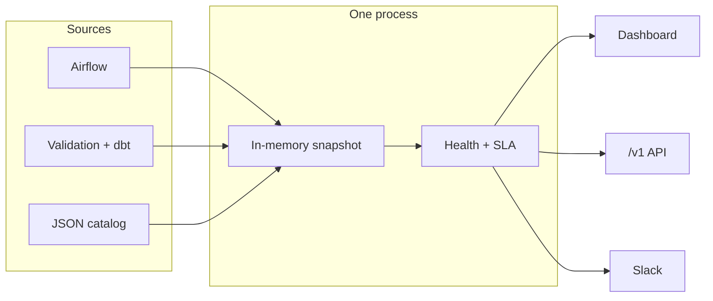

# InOrbit

**Live observability for data products.** One Go process polls Airflow and warehouse checks, scores health in memory, and serves the dashboard and Slack from that snapshot — not from a warehouse round-trip on every click.

The catalog is JSON. Add a product, a deployment, or a quality table without touching Go. The binary has no built-in product list.



Warehouse models stay for history, lineage, and catalog. They are not on the dashboard request path.

## What you get

| Surface | What it answers |
|---|---|
| **Health** | One score per product. Failed checks deduct; unknown dimensions weigh 0; SLA age still counts. |
| **Pipeline** | Active DAGs only: status, SLA, last/next run, timing, 7/30/90d reliability, **Open in Astro**. Freshness lives here — same table, not a second tab. |
| **Quality** | Latest validation and dbt / Elementary results, aggregated into the snapshot (not a copy of every warehouse row). |
| **Alerts** | Subscribe a Slack channel per product and audience. Alerts follow the same snapshot with the UI closed. |

Custom / ad-hoc DAGs stay visible. They are **not scored** and do not drive product SLA age.

## Run it in two commands

Needs [Go 1.23+](https://go.dev/dl/). No Airflow token. No warehouse login.

```bash
git clone https://github.com/redhat-data-and-ai/inorbit.git
cd inorbit
make test
make run
```

Open [http://localhost:8080/](http://localhost:8080/). You should see two sample products:

- **alpha** — hourly DAG past SLA (health at risk), plus a custom ad-hoc job that is listed but not scored
- **beta** — healthy scheduled DAG

Click a product → **Pipeline**. Expand a row. Times are local; hover for the exact timestamp.

The SLA clock ticks every 15s in process. In demo mode, Airflow and quality pollers log only — they do not call the network.

```bash
curl -s localhost:8080/healthz
curl -s localhost:8080/v1/meta
curl -s localhost:8080/v1/snapshots | python3 -m json.tool | head
curl -s localhost:8080/v1/data-products/alpha/health
curl -s localhost:8080/v1/data-products/alpha/pipeline
```

## Make it yours (still demo)

Products are config, not code. Edit [`configs/demo.json`](configs/demo.json) — names, DAGs, checks, Slack channels — or point `-config` at your own file and restart `make run`.

```json
{
  "id": "payments",
  "name": "payments",
  "type": "aggregate",
  "owner_team": "fintech",
  "slack_channel": "#dp-payments"
}
```

Then add matching `demo.dags` / `demo.checks` entries (times are Go durations before “now”, e.g. `"95m"`, `"2h"`). Restart. The new card shows up. No rebuild of a product registry.

To drop the bundled UI later: remove `web/`, `internal/web/`, and the `web.Mount` call in `cmd/inorbit`. Anything that can `GET /v1` can be the front end.

## Go live

Demo is the default. Live mode polls Airflow on startup, then on the run/tag intervals, and quality on a watermark.

1. Copy the example catalog (gitignored once copied):

```bash
cp configs/live.example.json configs/live.json
```

2. Replace the sample `alpha` / `beta` products and `prod` / `stage` deployments with yours. Shared Snowflake **account**, role, and warehouse go in that file. Tokens and `SNOWFLAKE_USER` stay in the environment (or a gitignored `.env`).

3. Export secrets and start:

| Env | Use |
|---|---|
| `ASTRO_TOKEN` or `ASTRO_API_TOKEN` | Bearer token for Airflow REST |
| `ASTRO_ORG_URL` | Org host, e.g. `https://<org-host>` |
| `INORBIT_ASTRO_DEPLOYMENT_ID` | Production deployment id |
| `INORBIT_AIRFLOW_API_URL` | Optional if you already have `{org}/{id}` or `{org}/{id}/api/v2` |
| `INORBIT_ASTRO_STAGE_DEPLOYMENT_ID` | Optional second deployment |
| `SNOWFLAKE_USER` | Warehouse user (or `snowflake.user_env` in JSON) |
| `SNOWFLAKE_PASSWORD` | Password auth |
| `SNOWFLAKE_PRIVATE_KEY_PATH` or `SNOWFLAKE_PRIVATE_KEY` | JWT key file or PEM |
| `SNOWFLAKE_ACCOUNT` / `SNOWFLAKE_ROLE` / `SNOWFLAKE_WAREHOUSE` | Overrides if omitted from `live.json` |

```bash
export ASTRO_TOKEN=...
export ASTRO_ORG_URL=https://<org-host>
export INORBIT_ASTRO_DEPLOYMENT_ID=<prod-deployment-id>
export INORBIT_ASTRO_STAGE_DEPLOYMENT_ID=<stage-deployment-id>   # optional
export SNOWFLAKE_USER=...
make run-live
```

Live Airflow URL: `{ASTRO_ORG_URL}/{deployment_id}/api/v2/dags`. **Open in Astro** uses the DAG overview `{ASTRO_ORG_URL}/{deployment_id}/dags/{dag_id}` (not a per-run page — those 403 under DAG-level RBAC).

Snowflake SSO should prompt **once** when the process starts. Quality polls reuse that session. Restarting `make run-live` logs in again.

Use **your** product ids in curl and the UI, not `alpha`, once you have replaced the example catalog.

```bash
curl -s localhost:8080/v1/meta | python3 -m json.tool
curl -s localhost:8080/v1/data-products/<your-id>/pipeline | python3 -m json.tool | head
```

### Is it actually live?

1. `GET /v1/meta` — `mode` is `live`, `last_astro_run_poll` is within ~90s, `data_product_count` matches `data_products` in config.
2. Open each product → **Pipeline**. You should see DAGs that tag or token-match that product, on the deployments you listed. Empty or stale Airflow rows stay off the table.
3. Click **Open in Astro**. Last success should match InOrbit’s `last_successful_at` (seconds-level).
4. Quality tables in that product’s `quality` block should match the Quality tab. Missing objects are skipped (0 rows).

Marts lag and may filter paused/stage DAGs. Use them as lagged confirmation, not as the live source of truth.

## How a DAG finds a product

Matching is deterministic. First hit wins:

1. Explicit `dag_ids` on the product (always pinned)
2. Airflow `dataproduct_name`
3. First non-system tag that equals a product id/name
4. Any tag that equals a product id/name
5. A **path token** in `dag_id` equal to the product id/name (longest wins)

Tokens split on non-alphanumerics, so `dbt_payments_daily` matches `payments`, and a bare `daily` DAG does **not** attach to a product named `inorbit`. Hyphens and underscores are ignored in tags and ids.

Paused DAGs are kept when they are custom, primary, or SLA-tagged. Untagged paused DAGs and rows with no status, last run, or next run are dropped unless they are custom.

**SLA** comes from DAG tags (`sla:interval_mins`, `sla:threshold_mins`, `sla:frequency_display`). If the threshold is missing, InOrbit uses 25% of the expected interval, minimum 30 minutes. Interval can fall back from cron / `@daily`. Ages and intervals render as minutes, hours, or days — not `—` when the clock knows the span.

## Quality sources

Live quality is per data product in config. Override `database`, `schema`, and `table` per product. Missing tables are skipped.

| Source | Default table | When |
|---|---|---|
| Validation | `{database}.QUALITY.VALIDATION_RESULT` | `quality.validation.enabled` |
| dbt / Elementary | `{database}.DBTLOGS.ELEMENTARY_TEST_RESULTS` | `quality.dbt.enabled` |

Health Score v2 is computed in process: only `FAILED` deducts, `UNKNOWN` dimensions have weight 0, coverage caps apply, and Astro freshness/pipeline virtual checks still contribute (except custom DAGs).

## HTTP API

The page only calls `/v1`. Same JSON for any client.

| Method | Path |
|---|---|
| `GET` | `/healthz` |
| `GET` | `/v1/meta` |
| `GET` | `/v1/snapshots` |
| `GET` | `/v1/data-products/{id}` |
| `GET` | `/v1/data-products/{id}/health` |
| `GET` | `/v1/data-products/{id}/pipeline` |
| `GET` | `/v1/data-products/{id}/freshness` |
| `GET` | `/v1/data-products/{id}/quality` |
| `GET` | `/v1/data-products/{id}/health-trend` |
| `GET` | `/v1/subscriptions` |
| `POST` | `/v1/subscriptions` |
| `DELETE` | `/v1/subscriptions/{id}` |

`/freshness` is still served for API clients; the UI folds it into **Pipeline**.

```bash
curl -s -X POST localhost:8080/v1/subscriptions \
  -d '{"data_product_id":"alpha","audience":"developer","slack_channel":"#dp-alpha"}'
```

## Extend it

InOrbit is a small loop: **ingest → snapshot → evaluate → serve**. Each piece is a package you can grow without rewriting the rest.

| You want to… | You change… |
|---|---|
| Watch another data product | `data_products` in JSON |
| Poll another Airflow deployment | `astro.deployments` |
| Pin DAGs that tags miss | `dag_ids` on the product |
| Point at different quality tables | `quality.validation` / `quality.dbt` per product |
| Demo a failure mode locally | `demo.dags` / `demo.checks` in `configs/demo.json` |
| Slow down or speed up polls | `-astro-run-seconds`, `-astro-tag-seconds`, `-quality-seconds`, `-clock-seconds` |
| Swap the UI | anything that reads `/v1` (or delete `web.Mount`) |
| Add a new live source later | new ingest package that upserts the same snapshot |

Flags (defaults match the table below): `-addr`, `-mode` (`demo` \| `live`), `-config`, plus the four interval flags. `INORBIT_HTTP_ADDR`, `INORBIT_MODE`, and `INORBIT_CONFIG` work as env equivalents.

### Poll intervals

Opening a dashboard page does **not** start pollers. An expired UI cache only means the dashboard calls InOrbit again.

| Loop | Default | I/O |
|---|---|---|
| SLA clock | 15s | none |
| Airflow latest runs | 90s | Airflow API per deployment |
| Airflow DAG tags | 10 min | Airflow API |
| Quality / dbt logs | 2 min | Warehouse watermark |

## 200 data products (memory and speed)

`GET /v1/meta` includes `scale`, projected from the live snapshot to **200** products. The UI masthead shows the same estimate.

- **Memory:** JSON snapshot × 200/N, plus ~3× heap copies and a 48 MiB process floor. Typical 80–200 KiB JSON per product → **~50–150 MiB RSS** at 200.
- **Airflow:** Listing cost is per deployment, not per product. Latest-run fetches grow with matched DAGs (8 workers). Keep the 90s run poll if matched DAGs stay in the low thousands; raise the interval if a poll overruns.
- **Quality:** One Snowflake session, sequential latest-run query per product. Missing tables are skipped. Budget **1–5 minutes** at 200 products, or raise `-quality-seconds`.
- **SLA clock:** in-process, no I/O; 15s stays cheap at 200.

## Lagged warehouse check (optional)

If you already materialize pipeline marts, use them as confirmation — they are not the live path.

```sql
-- replace database / product ids from your warehouse
select dag_id, astro_url, astro_deployment_name, dag_status,
       dag_freshness_status, last_successful_at
from {OBSERVABILITY_DB}.MARTS.PIPELINE_STATUS
where lower(coalesce(data_product_name, data_product_id)) in ('alpha', 'beta')
order by data_product_name, is_primary_dag desc, dag_id;
```
