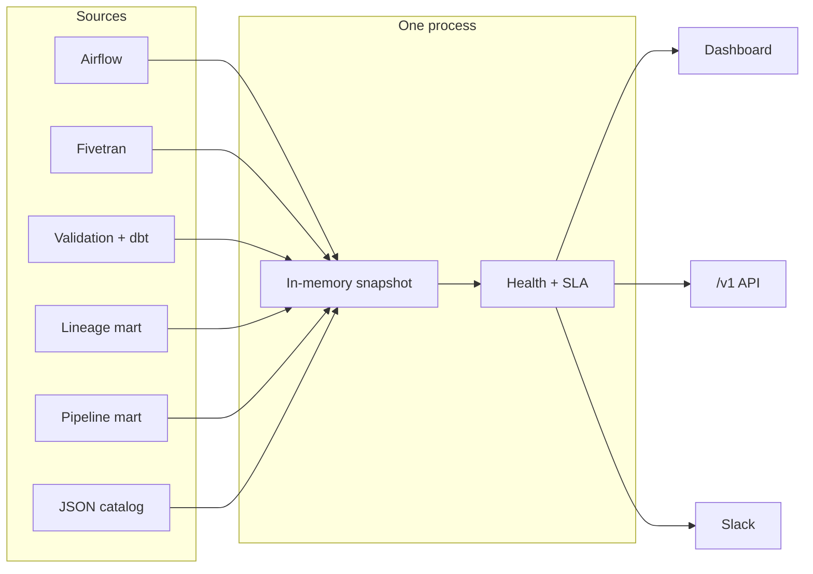

# InOrbit

**Live observability for data products.** One Go process polls Airflow, Fivetran, and warehouse checks, scores health in memory, and serves the dashboard and Slack from that snapshot — not from a warehouse round-trip on every click.

The catalog is JSON. Add a product, a deployment, or a quality table without touching Go. The binary has no built-in product list.


```mermaid
flowchart LR
  subgraph sources [Sources]
    AF[Airflow]
    FT[Fivetran]
    Q[Validation + dbt]
    L[Lineage mart]
    P[Pipeline mart]
    C[JSON catalog]
  end
  subgraph inorbit [One process]
    S[In-memory snapshot]
    E[Health + SLA]
  end
  AF --> S
  FT --> S
  Q --> S
  L --> S
  P --> S
  C --> S
  S --> E
  E --> UI[Dashboard]
  E --> API["/v1 API"]
  E --> SL[Slack]
```

Warehouse models stay for history, lineage, and pipeline fill. Clicks still read the in-memory snapshot.

## What you get

| Surface | What it answers |
|---|---|
| **Health** | One score per product. Failed checks deduct; unknown dimensions weigh 0; SLA age still counts. |
| **Pipeline** | Active DAGs: status, SLA, last/next run, timing, 7/30/90d reliability, **Open in Astro**. Source-aligned products also note Fivetran connector count. Freshness lives here — same table, not a second tab. |
| **Quality** | Latest validation and dbt / Elementary results, aggregated into the snapshot (not a copy of every warehouse row). |
| **Lineage** | Upstream sources and downstream consumers from `{observability_db}.MARTS.DP_LINEAGE`. Source-aligned Fivetran chips show connector type, connection count, and paused state. Warehouse mart, not a live Airflow poll. |
| **Alerts** | Subscribe a Slack channel per product and audience. Alerts follow the same snapshot with the UI closed. |

Custom / ad-hoc DAGs stay visible. They are **not scored** and do not drive product SLA age.

## Run it in two commands

Needs [Go 1.23+](https://go.dev/dl/). No Airflow token. No warehouse login.

```bash
git clone https://github.com/inorbit/inorbit.git
cd inorbit
make test
make run
```

Open [http://localhost:8080/](http://localhost:8080/). You should see two sample products:

- **alpha** — hourly DAG past SLA (health at risk), plus a custom ad-hoc job that is listed but not scored
- **beta** — healthy scheduled DAG

Click a product → **Pipeline**. Expand a row. Times are local; hover for the exact timestamp.

The SLA clock ticks every 15s in process. In demo mode, Airflow and quality pollers log only — they do not call the network.

```bash
curl -s localhost:8080/healthz
curl -s localhost:8080/v1/meta
curl -s localhost:8080/v1/snapshots | python3 -m json.tool | head
curl -s localhost:8080/v1/data-products/alpha/health
curl -s localhost:8080/v1/data-products/alpha/pipeline
```

## Make it yours (still demo)

Products are config, not code. Edit [`configs/demo.json`](configs/demo.json) — names, DAGs, checks, Slack channels — or point `-config` at your own file and restart `make run`.

```json
{
  "id": "payments",
  "name": "payments",
  "type": "aggregate",
  "owner_team": "fintech",
  "slack_channel": "#dp-payments"
}
```

Then add matching `demo.dags` / `demo.checks` entries (times are Go durations before “now”, e.g. `"95m"`, `"2h"`). Restart. The new card shows up. No rebuild of a product registry.

To drop the bundled UI later: remove `web/`, `internal/web/`, and the `web.Mount` call in `cmd/inorbit`. Anything that can `GET /v1` can be the front end.

## Go live

Demo is the default. Live mode polls Airflow on startup, then on the run/tag intervals, and quality on a watermark.

1. Copy the example catalog (gitignored once copied):

```bash
cp configs/live.example.json configs/live.json
```

2. Replace the sample products and deployments with yours. Add an object under `astro.deployments` for every Airflow workspace you want live Pipeline for. Shared Snowflake **account**, role, and warehouse go in that file. Tokens and `SNOWFLAKE_USER` stay in the environment (or a gitignored `.env`). Empty `${...}` deployment ids are skipped.

3. Export secrets and start:

| Env | Use |
|---|---|
| `ASTRO_TOKEN` or `ASTRO_API_TOKEN` | Bearer token for Airflow REST |
| `ASTRO_ORG_URL` | Org host, e.g. `https://<org-host>` |
| `INORBIT_ASTRO_DEPLOYMENT_ID` | Production deployment id |
| `INORBIT_AIRFLOW_API_URL` | Optional if you already have `{org}/{id}` or `{org}/{id}/api/v2` |
| `INORBIT_ASTRO_STAGE_DEPLOYMENT_ID` | Optional second deployment |
| `SNOWFLAKE_USER` | Warehouse user (or `snowflake.user_env` in JSON) |
| `SNOWFLAKE_PASSWORD` | Password auth |
| `SNOWFLAKE_PRIVATE_KEY_PATH` or `SNOWFLAKE_PRIVATE_KEY` | JWT key file or PEM |
| `SNOWFLAKE_ACCOUNT` / `SNOWFLAKE_ROLE` / `SNOWFLAKE_WAREHOUSE` | Overrides if omitted from `live.json` |
| `FIVETRAN_API_KEY` / `FIVETRAN_API_SECRET` | Fivetran REST Basic auth for source-aligned connectors |

```bash
export ASTRO_TOKEN=...
export ASTRO_ORG_URL=https://<org-host>
export INORBIT_ASTRO_DEPLOYMENT_ID=<prod-deployment-id>
export INORBIT_ASTRO_STAGE_DEPLOYMENT_ID=<stage-deployment-id>   # optional
export SNOWFLAKE_USER=...
make run-live
```

Live Airflow URL: `{ASTRO_ORG_URL}/{deployment_id}/api/v2/dags`. **Open in Astro** uses the DAG overview `{ASTRO_ORG_URL}/{deployment_id}/dags/{dag_id}` (not a per-run page — those 403 under DAG-level RBAC).

Snowflake SSO should prompt **once** when the process starts. Quality polls reuse that session. Restarting `make run-live` logs in again.

Use **your** product ids in curl and the UI, not `alpha`, once you have replaced the example catalog.

```bash
curl -s localhost:8080/v1/meta | python3 -m json.tool
curl -s localhost:8080/v1/data-products/<your-id>/pipeline | python3 -m json.tool | head
```

### Is it actually live?

1. `GET /v1/meta` — `mode` is `live`, `last_astro_run_poll` is within ~90s, `data_product_count` matches `data_products` in config.
2. Open each product → **Pipeline**. You should see DAGs from listed Airflow deployments **and** warehouse pipeline-mart rows for catalog products those APIs do not return. Source-aligned products show a connector count that links to Lineage.
3. Click **Open in Astro** on a DAG row. Last success should match InOrbit’s `last_successful_at` (seconds-level) on live rows; mart `astro_url` is passed through from the warehouse. Source-aligned Lineage chips should show connector type instead of a generic `fivetran_db` label.
4. Quality tables in that product’s `quality` block should match the Quality tab. Missing objects are skipped (0 rows).

Marts lag and may filter paused/stage DAGs. Use them as lagged confirmation, not as the live source of truth.

## How a DAG finds a product

Matching is deterministic. First hit wins:

1. Explicit `dag_ids` on the product (always pinned)
2. Airflow `dataproduct_name`
3. First non-system tag that equals a product id/name
4. Any tag that equals a product id/name
5. A **path token** in `dag_id` equal to the product id/name (longest wins)

Tokens split on non-alphanumerics, so `dbt_payments_daily` matches `payments`, and a bare `daily` DAG does **not** attach to a product named `inorbit`. Hyphens and underscores are ignored in tags and ids.

## How a Fivetran connector finds a product

Live Fivetran is the REST API (`GET /v1/groups` then connections per destination), not the warehouse log connector. Only **source-aligned** products auto-match. First hit wins:

1. Explicit `fivetran_connector_ids` on the product (any type; always pinned)
2. Destination **schema** equal to the product id/name (longest wins; `schema.table` uses the first token)
3. Connector **service** equal to the product id/name

The destination/group name is the environment (`prod`, `stage`, …) so Production and Pre Prod stay split. Sync frequency becomes the expected interval; SLA is 25% of that interval, minimum 30 minutes — same clock as DAGs. Failed or overdue syncs create the same freshness/pipeline virtual checks. Stage connectors are not scored when a production connector exists.

Connectors are **not** Pipeline DAG rows. Source-aligned Pipeline notes how many connectors the product has; Lineage upstream chips group by destination schema and connector type (logo mark, type name, connection count, and a Paused chip when any connection is paused). Snowpipe and external-table nodes stay generic. Aggregate products keep warehouse `fivetran_db` chips unchanged.

Put `FIVETRAN_API_KEY` and `FIVETRAN_API_SECRET` in `.env` (gitignored). Optional `fivetran.group_ids` in config limits which destinations are polled. Connector dashboard URLs use `{dashboard_url}/{connection_id}` (default `https://fivetran.com/dashboard/connections`).

Paused DAGs are kept when they are custom, primary, or SLA-tagged. Untagged paused DAGs and rows with no status, last run, or next run are dropped unless they are custom.

**SLA** comes from DAG tags (`sla:interval_mins`, `sla:threshold_mins`, `sla:frequency_display`). If the threshold is missing, InOrbit uses 25% of the expected interval, minimum 30 minutes. Interval can fall back from cron / `@daily`. Ages and intervals render as minutes, hours, or days — not `—` when the clock knows the span.

## Quality sources

Live quality is per data product in config. Override `database`, `schema`, and `table` per product. Missing tables are skipped. Validation keeps every row for the **latest `RUN_ID`**. dbt / Elementary keeps the **latest invocation**. Older runs are not shown.

| Source | Default table | When |
|---|---|---|
| Validation | `{database}.QUALITY.VALIDATION_RESULT` | `quality.validation.enabled` |
| dbt / Elementary | `{database}.DBTLOGS.ELEMENTARY_TEST_RESULTS` | `quality.dbt.enabled` |

Health Score v2 is computed in process: only `FAILED` deducts, `UNKNOWN` dimensions have weight 0, coverage caps apply, and Astro / Fivetran freshness/pipeline virtual checks still contribute (except custom DAGs).

## Lineage (warehouse mart)

The Lineage tab is **not** live. It reads `{observability_db}.MARTS.DP_LINEAGE` (override with the `lineage` block in config): upstream sources, downstream consumers, blast radius, and neighbor health. In demo mode the same shape is in `demo.lineage`. For source-aligned products, live Fivetran connections replace generic `fivetran_db` chips with one node per (schema, connector type).

**Pipeline** prefers live Airflow for dag_ids returned by `astro.deployments`. Catalog products with no match there are filled from `{observability_db}.MARTS.PIPELINE_STATUS` (override with the `pipeline` block; defaults to the same database/schema as lineage). List every Airflow deployment you want live; the mart covers the rest without putting hostnames in Go. Live Fivetran is scored with the same clock as DAGs but rendered on Lineage, not as extra DAG rows.

Add **your** products under `data_products` in `configs/live.json` (gitignored). Include both `aggregate` and `source-aligned` types; the homepage filters by type. Matching still uses tags, `dag_ids`, and dag_id tokens. Source-aligned products also match Fivetran by destination schema, connector service, or explicit `fivetran_connector_ids`.

```bash
curl -s localhost:8080/v1/data-products/alpha/lineage | python3 -m json.tool | head
```

## HTTP API

The page only calls `/v1`. Same JSON for any client.

| Method | Path |
|---|---|
| `GET` | `/healthz` |
| `GET` | `/v1/meta` |
| `GET` | `/v1/snapshots` |
| `GET` | `/v1/data-products/{id}` |
| `GET` | `/v1/data-products/{id}/health` |
| `GET` | `/v1/data-products/{id}/pipeline` |
| `GET` | `/v1/data-products/{id}/freshness` |
| `GET` | `/v1/data-products/{id}/quality` |
| `GET` | `/v1/data-products/{id}/lineage` |
| `GET` | `/v1/data-products/{id}/health-trend` |
| `GET` | `/v1/subscriptions` |
| `POST` | `/v1/subscriptions` |
| `DELETE` | `/v1/subscriptions/{id}` |

`/freshness` is still served for API clients; the UI folds it into **Pipeline**.

```bash
curl -s -X POST localhost:8080/v1/subscriptions \
  -d '{"data_product_id":"alpha","audience":"developer","slack_channel":"#dp-alpha"}'
```

## Extend it

InOrbit is a small loop: **ingest → snapshot → evaluate → serve**. Each piece is a package you can grow without rewriting the rest.

| You want to… | You change… |
|---|---|
| Watch another data product | `data_products` in JSON |
| Poll another Airflow deployment | `astro.deployments` |
| Fill Pipeline from the warehouse mart | `pipeline` table (defaults to `MARTS.PIPELINE_STATUS`) |
| Pin DAGs that tags miss | `dag_ids` on the product |
| Poll Fivetran for source-aligned products | `fivetran` block + `FIVETRAN_API_KEY` / `FIVETRAN_API_SECRET` |
| Pin connectors that schema match misses | `fivetran_connector_ids` on the product |
| Point at different quality tables | `quality.validation` / `quality.dbt` per product |
| Demo a failure mode locally | `demo.dags` / `demo.checks` / `demo.connectors` in `configs/demo.json` |
| Slow down or speed up polls | `-astro-run-seconds`, `-astro-tag-seconds`, `-quality-seconds`, `-clock-seconds` |
| Swap the UI | anything that reads `/v1` (or delete `web.Mount`) |
| Add a new live source later | new ingest package that upserts the same snapshot |

Flags (defaults match the table below): `-addr`, `-mode` (`demo` \| `live`), `-config`, plus the four interval flags. `INORBIT_HTTP_ADDR`, `INORBIT_MODE`, and `INORBIT_CONFIG` work as env equivalents.

### Poll intervals

Opening a dashboard page does **not** start pollers. An expired UI cache only means the dashboard calls InOrbit again.

| Loop | Default | I/O |
|---|---|---|
| SLA clock | 15s | none |
| Airflow latest runs | 90s | Airflow API per deployment |
| Fivetran connectors | 90s | Fivetran REST (same ticker as Airflow runs) |
| Airflow DAG tags | 10 min | Airflow API |
| Quality / dbt / marts | 5 min | Warehouse watermark (quality, lineage, pipeline mart). dbt tests follow the pipeline, not this poll. |

## 200 data products (memory and speed)

`GET /v1/meta` includes `scale`, projected from the live snapshot to **200** products. The UI masthead shows the same estimate.

Measured on a 40-product live catalog (14 Airflow deployments, HTTP up after ingest):

| | 40 products (this run) | 200 products (linear from snapshot) |
|---|---|---|
| Process RSS | **~49 MiB** | **~58 MiB** estimated (`/v1/meta`) |
| Snapshot JSON | 656 KiB (~17 KiB/product) | ~3.2 MiB |
| Airflow poll | **~16–29s** (4 deployments at a time) | listing stays per-deployment; run fetches grow with matched DAGs |
| Quality poll | **8 products at a time**; later passes ~20s at 40 products | stays behind the 5 min default; raise `-quality-seconds` if a poll overruns |
| Lineage + pipeline marts | **~5s** together | stays one/two warehouse queries |

- **Memory is not the limiter.** The 48 MiB process floor dominates; even 200 products stay well under 128 MiB.
- **Do not poll quality faster than dbt.** Tests land when the pipeline runs. Default `-quality-seconds 300` (5 min). Parallel warehouse queries make each poll short; a shorter interval only repeats the same watermark.
- **Airflow:** default `-astro-run-seconds 90` is enough when deployments fetch in parallel. Raise it only if a poll overruns.
- **SLA clock:** in-process, no I/O; 15s stays cheap at 200.

## Warehouse pipeline mart

Live Airflow only sees deployments listed in config. If you already materialize pipeline status (the same table a mart-based console uses), InOrbit reads it and **merges** those rows: live Airflow and Fivetran win on the same identity, the mart fills everything else.

```sql
-- replace database / product ids from your warehouse
select dag_id, astro_url, astro_deployment_name, dag_status,
       dag_freshness_status, dag_last_successful_run_at
from {OBSERVABILITY_DB}.MARTS.PIPELINE_STATUS
where lower(coalesce(data_product_name, data_product_id)) in ('alpha', 'beta')
order by data_product_name, is_primary_dag desc, dag_id;
```
